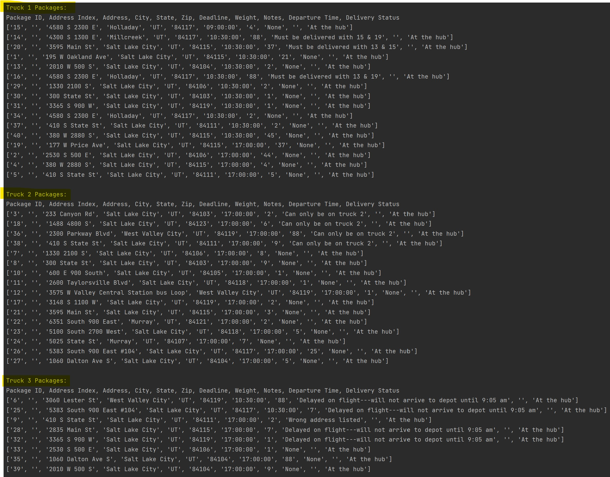
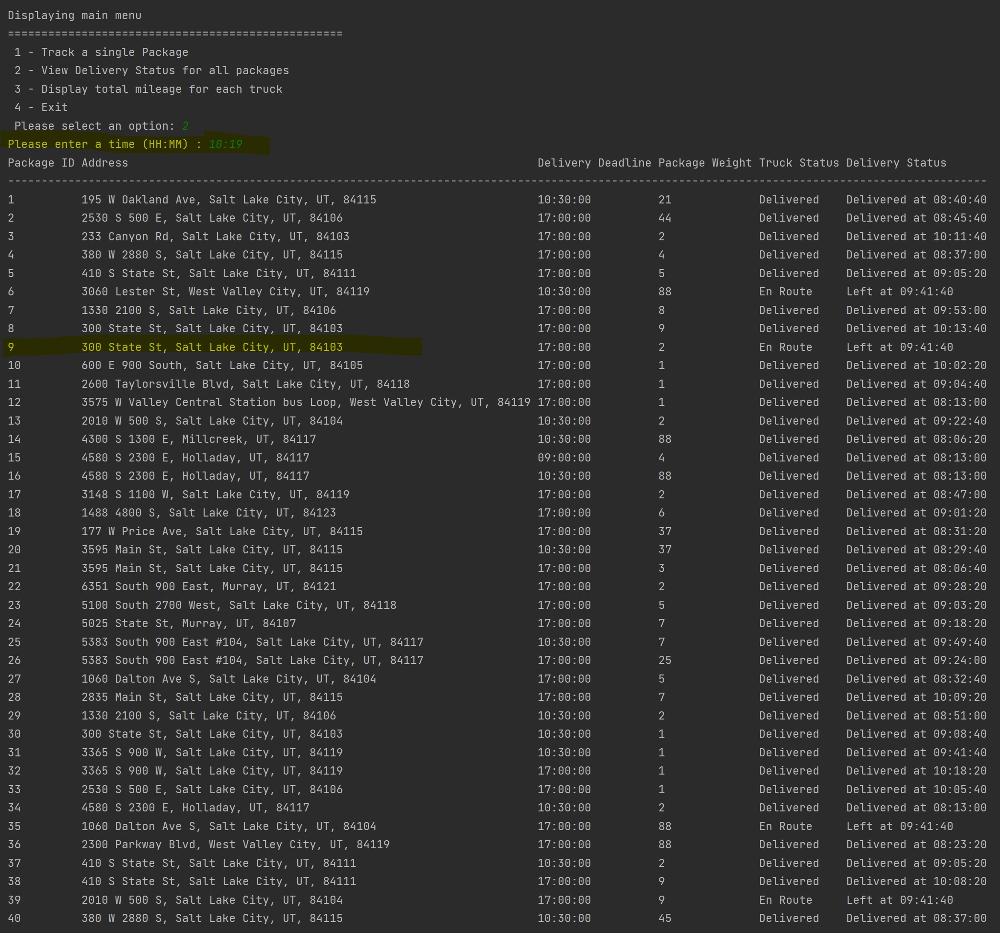
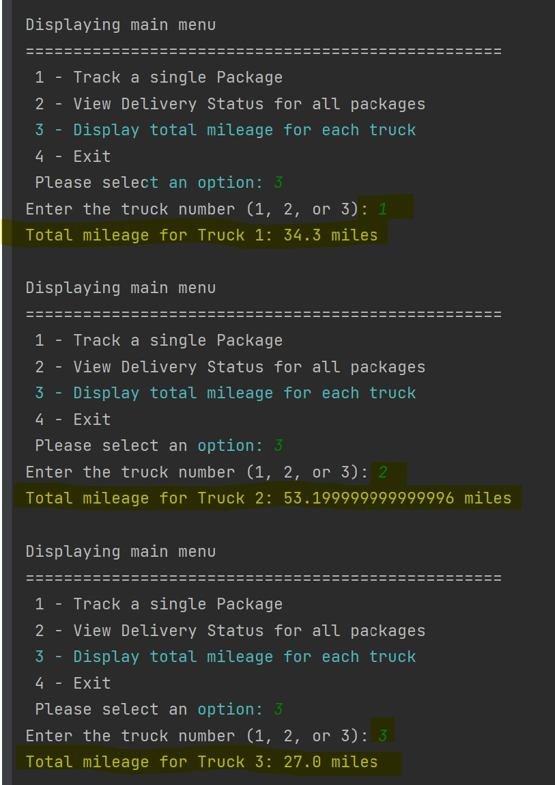

# Package Delivery Optimization

## Overview
This project provides an efficient package delivery system that utilizes data structures, algorithms, and a hash table for efficient package look-up and tracking. The system is built using Python and optimizes the allocation and delivery of packages using three trucks.

### Project Details
- **Project Name:** Package Delivery Optimization
- **Author:** Mehdi Rahimi
- **Course:** C950 Data Structures and Algorithms II
- **Institution:** Western Governors University (WGU)
- **Revision:** 1.0
- **Date:** April 8, 2023

## Introduction
The package delivery system efficiently allocates and delivers packages using three trucks. The system incorporates a modified Greedy algorithm, which utilizes elements of the Nearest Neighbor algorithm and Dijkstra's shortest path algorithm to efficiently deliver packages.

## Features
- Efficient package allocation and delivery using three trucks.
- Utilizes data structures, algorithms, and hash tables.
- Optimized for better efficiency and performance.
- Includes package look-up and tracking functionality.

## Algorithm Details
### Modified Greedy Algorithm
1. **Allocate packages to trucks** based on delivery deadlines, special notes, and truck capacities.
2. **Start at the hub** (depot) as the current location for each truck.
3. For each truck, **find the shortest path** to deliver all the packages assigned to it.
4. **Update package information** and recalculate paths if necessary.
5. **Keep track of each truck's path**, distances traveled, and arrival times at each location.
6. Once all packages are delivered, **return each truck to the hub**.

### Logic Comments
#### Pseudocode for the Greedy Algorithm:
Algorithm: Modified Greedy Algorithm for Package Delivery

Input: 
- Package information (including package ID, address, deadline, and other relevant details)
- Address and distance information for all locations
- Number of trucks

Initialize all trucks and packages
Initialize the current time

While there are undelivered packages:
    For each truck:
        If the truck is available:
            Allocate packages to the truck based on the greedy algorithm, considering deadlines and other constraints
            Calculate the shortest path for the truck using Dijkstra's algorithm
            Deliver packages following the shortest path
            Update package and truck status
    Update the current time

### Development Environment
- **IDE:** PyCharm 2022.3.3 (Professional Edition)
- **Python Version:** 3.10.9

### Space-Time Complexity and Big-O Analysis
- `track_package()`: O(N) time complexity, O(1) space complexity
- `view_delivery_status()`: O(N) time complexity, O(N) space complexity
- `main_menu()`: O(1) time complexity, O(1) space complexity

### Scalability and Adaptability
- The solution is designed to handle a growing number of packages efficiently using a hash table.
- The algorithm's performance mainly depends on the loading and delivering of packages.

### Software Efficiency and Maintainability
- The software uses modular functions and classes, making it easy to understand and modify.
- The chosen algorithm and data structures are efficient in terms of space and time complexity.

### Strengths and Weaknesses of the Hash Table
- **Strengths:** Fast look-up times, efficient use of memory, and easily scalable.
- **Weaknesses:** Potential collisions may increase look-up time and less efficient space usage when the load factor is high.

## Project Structure
The project is organized as follows:

- `csvReader.py`: Reads CSV files containing package and distance information.
- `Distance.py`: Manages distance calculations between delivery locations.
- `Hashtable.py`: Implements a hash table for efficient package look-up.
- `main.py`: The main execution file that runs the delivery algorithm.
- `Package.py`: Defines the package data structure.

Additional directories include:
- `CSV/`: Contains the input CSV files (`Addresses.csv`, `Distances.csv`, `Packages.csv`).
- `Screenshots/`: Contains screenshots demonstrating the application's functionality.

## Setup Instructions
1. **Clone the Repository:**
   ```sh
   git clone https://github.com/exxxius/PackageDeliveryOptimization.git
   ```
2. **Navigate to the Project Directory:**
   ```sh
   cd PackageDeliveryOptimization
   ```
3. **Ensure Python is Installed:**
   Make sure you have Python 3.x installed on your machine. You can download it from [python.org](https://www.python.org/).

4. **Install Dependencies:**
   Install any required dependencies using pip. You may want to create a virtual environment first.
   ```sh
   pip install -r requirements.txt
   ```

## Usage
Run the `main.py` file to start the package delivery optimization process:
```sh
python main.py
```

## Screenshots
Here are some screenshots demonstrating the application's functionality:





## License
This project is licensed under the MIT License. See the LICENSE file for details.

## Contact
For any inquiries or issues, please contact Mehdi Rahimi at [your email address].
```

### Instructions to Add the README.md to Your Repository

1. **Create the README.md File:**
   ```sh
   touch README.md
   ```

2. **Open the README.md File:**
   Open the `README.md` file in a text editor and paste the above content into it.

3. **Stage and Commit the README.md File:**
   ```sh
   git add README.md
   git commit -m "Add detailed README.md"
   ```

4. **Push the Changes to the Repository:**
   ```sh
   git push origin main
   ```
